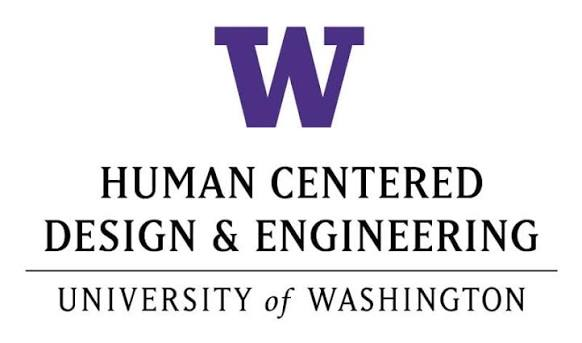
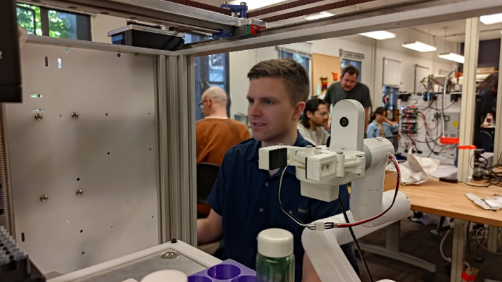
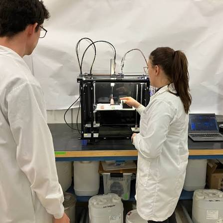

# HCDE 的用户研究课，到底在学什么

第一次做项目时，我很想赶快画界面。老师看了一会儿草图，问我：你是在解决什么，还是在把你喜欢的答案画出来？这话当时听着不太舒服。

HCDE 518 是以用户为中心设计的核心课。它会教访谈、persona 和可用性测试，但真正逼你练的是先承认自己不知道。

开始前，老师会让你把一句模糊的兴趣改成能研究的问题。比如“大家喜不喜欢这个功能”基本没有用，太早把答案塞进去了。换成“第一次用的人在哪一步停下来，他们以为接下来会发生什么”，你才知道该观察什么、该问谁。问题写得差，后面做再多访谈也是一堆热闹的笔记。

我们做过一个和博物馆体验有关的项目。我以为大家缺信息，后来去现场才发现，有的人怕走错，有的人不想一个人逛，有的人根本不想再看更多内容。

原来的方案没有完全错，只是它回答得太快了。

自己访谈、观察，拿到的是具体的人和场景。报告、论文、市场资料给的是更大的背景。前者容易太小，后者又离你的问题太远。

做完访谈也不是把几个金句贴到 PPT 上。我们会把记录摊开，先分哪些是事实，哪些是受访者自己的解释，再看不同人有没有重复的行为。有人说“我不需要”，但站在入口五分钟没动，这两个信息要一起看。样本很小也没关系，只要别把五个人的经历说成所有人的需求。研究不是拿来替设计背书，它经常只是把你原来以为的问题拆碎。

我现在还会相信直觉。只是不会一上来就把它当结论。

之后才是线框、原型、测试。低保真原型有一个好处，它丑得不值得你太骄傲。用户说不懂，你比较不会急着解释“其实这里是这样的”。改掉就行。

测试时我现在会忍住不解释。给任务，停下来，看对方先点哪里，什么时候皱眉，问完再追一句“你刚才以为会发生什么”。用户不会替你总结设计原则，但他们会把理解错的地方演给你看。一次测试结束，改不改、改哪一处、哪些问题先不动，都是判断，不是把所有意见平均一下。

这门课没有让我变得更会说“以用户为中心”。我现在反而有点警惕这句话。

你访谈过五个人，不代表你理解用户。你只是在知道，自己原来不知道得那么多。
