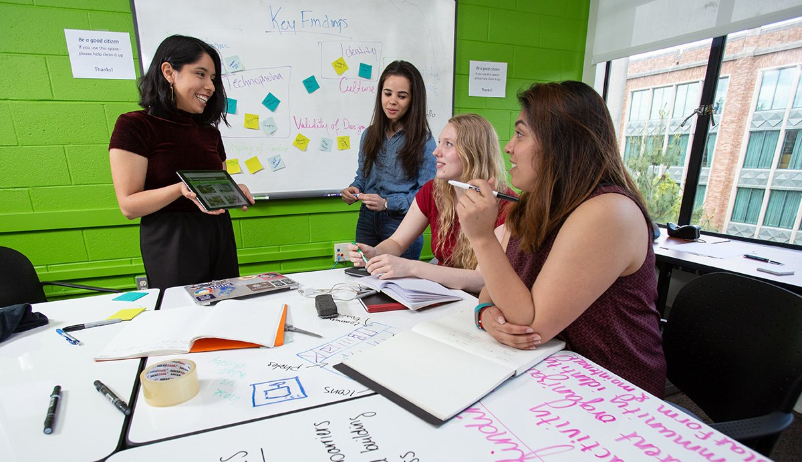

# 一年制 MHCI+D 的 365 天，到底有多忙

开学前有人问我，一年制到底有多忙。我当时说，应该就是作业多一点。第二周就不这么说了。

MHCI+D 是 11 个月的 cohort 项目。时间表会把人推得很快，但“忙”不只是睡得少。最难的部分，是你还没想清楚一个问题，就得拿着它去跟组员、老师和外部的人讨论。对方会问你为什么。你不能总回答“我觉得”。

我后来把一周拆开看，才知道时间去哪了。上课和读材料占掉白天，晚上不是单纯做作业，更多是在约访谈、整理记录、改共享文档、补一个组员没做完的部分。周末原本想留给求职，常常被下周的演示提前拿走。一年制最难受的不是某一周爆掉，是它没有很长的恢复期，刚交完一个东西，下一个已经开始了。

我以前习惯先把方案想完整。至少在自己心里完整，再讲出来。studio 不是这个逻辑。它要求你尽早把半成品放到桌上，让别人挑错。研究没做够，问题定义太大，原型只是在逃避判断，这些都会被人说出来。

刚开始我会把 critique 当成否定。后来才慢慢分开：别人否定的是这个版本，不是我这个人。虽然在凌晨一点的时候，这两件事很难分。

小组作业也很消耗人。有人觉得研究更重要，有人想赶快做出来。项目快结束时，所有人都会有点固执。

我学到一个很笨但有用的习惯：每次会后写三句话，今天到底决定了什么，谁在什么时候交什么，下次争的是哪一个问题。不要只靠大家“应该都记得”。团队做得差的时候，很多矛盾不是意见不同，是每个人脑子里那份项目版本不一样。把它写出来以后，气氛不一定立刻变好，至少不会继续空转。

我后来不太用“抗压”形容这段时间。这个词很方便，也没什么内容。

它更像是训练你在答案不完整、时间不够、意见互相打架的时候，先做一个暂时的判断。然后在新证据出现以后，把它改掉。

如果还想找工作，这个节奏会更别扭。作品集、简历、投递和面试准备不会等课程结束才出现。有人把求职完全挪到最后，风险很高；也有人一开始就把项目当作品集素材，研究记录、失败版本、自己负责的部分都顺手存下来。后者并不轻松，只是毕业前不会突然发现，过去十个月没有一件东西讲得清。

毕业以后，我还会熬夜吗。会。

但我现在知道，熬夜本身不说明任何事。真正有用的是，第二天你能不能解释自己昨晚为什么改了那个决定。
