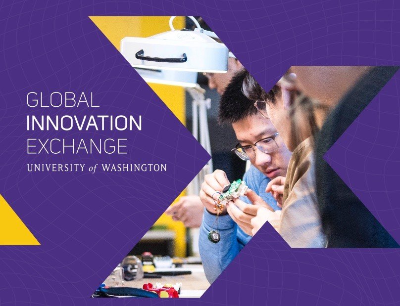
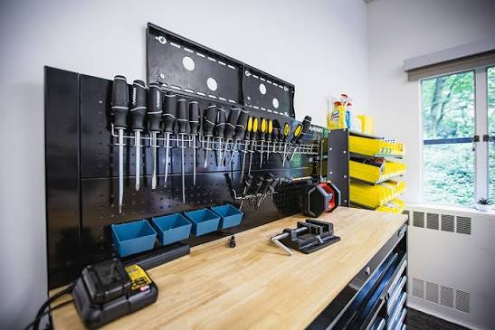
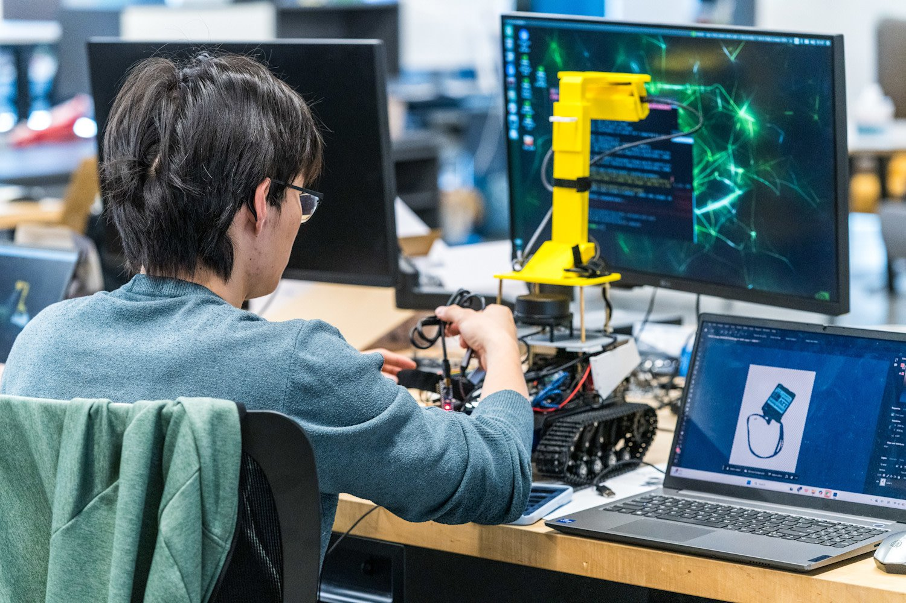

# 在微软园区读硕士，MSTI 到底在学什么

第一天到 Redmond，我有一点错觉。

门禁、楼、咖啡厅、穿工牌的人，看上去都像在上班。后来才想起来，我还是学生，只是教室放在微软总部园区里。MSTI 全日制从 2026 年夏天起在这里上课，21 个月，周一到周四白天排课。

这个场景很容易让人误会项目的重点是“离大厂近”。我觉得不是。它不让你待在一个擅长的角落里。上午讨论用户需求，下午碰传感器、代码、物理原型，晚上团队又问这个东西谁会买。

我原来以为技术创新就是学几个新工具。进来以后才发现，它更像把你从“我负责设计这部分”的习惯里拔出来。你得知道设计会给工程带来什么成本。有些方案能做，但没人需要。

一个项目做下来，最费时间的往往不是画板子。是把一句很像需求的话拆开。“老人需要陪伴”“上班族需要更高效”，这些都太大。你得继续问：在什么时刻，谁愿意为这个东西换一个习惯，失败了以后会怎样。再往后是物料、数据、维护、演示时能不能稳定跑完。每往前推一步，原来那个很聪明的点子都会变普通一点，也更接近真的能用。

这也是为什么我不太建议只想做 UI 的人来。

MSTI 会不停追问 UI 后面的东西：它接的是什么系统，数据从哪里来，硬件坏了怎么办，谁愿意付钱。对这些没兴趣，课程会很绕。

申请前我会建议先做一个很小的东西，不必为了申请硬造“创新产品”。找一个身边真实的不方便，做一次访谈，拿纸板、Figma 或现成模块拼个原型，然后让三五个人试。你会马上知道自己讨不讨厌那段反复返工。喜欢界面的人不等于会喜欢这个过程，喜欢技术的人也不一定喜欢跟人解释为什么要做。

我最喜欢的反而是那些没做成的原型。焊接错了，机器不动，传感器数据乱跳。它们把“创新”这个词拽回地面。很多好点子不是输在想法上，是输在没人算过它到底怎么活下来。

在园区里上课不会自动让你像微软员工。它只会让你更早看到，真实产品有多不浪漫。对我来说，这比一张好看的项目标签有用一点。

我后来理解的 MSTI，不是“在微软旁边读书”。它比较适合愿意把自己从一个专业标签里拽出来的人。你得碰一点工程，碰一点市场，也得接受原型很难像渲染图那么干净。要是这些麻烦听起来就很烦，早点承认也没什么丢人的，项目匹配比地点重要。
