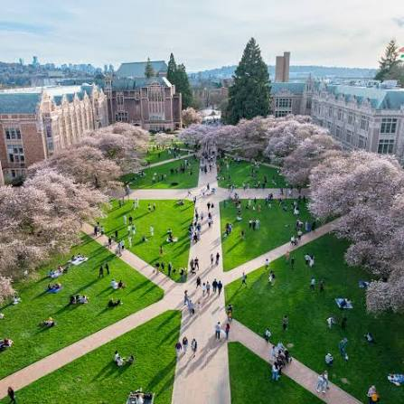
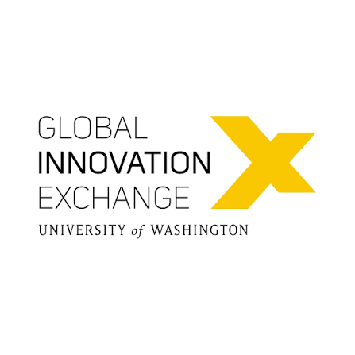

# 拿到 UW 的 offer 之后，我是怎么选项目的

offer 来的时候，我没有马上高兴。

我先把几个项目写在一张纸上，旁边只留了三栏：我要学什么、我要失去什么、两年后我还认不认这个选择。

排名、城市、朋友圈里谁说哪个项目更强，都先划掉。那些东西不是没用，只是它们很难替你上课，也很难替你在半夜赶项目。

我还写了第四栏：这一年或两年，我靠什么活。学费只是最显眼的数字。房租、医保、回国机票、没有实习收入的那段空档，都得放进去。有人觉得这是太现实了。我觉得申请时把钱说清楚，反而是对自己负责。一个很喜欢的项目，如果预算只能靠“到时候再想办法”，它会慢慢变成另一种压力。

MHCI+D 是 11 个月的 cohort 项目，studio 密度高。我喜欢它的速度，也怕它的速度。当时我还想补研究、补表达、留出实习的可能，它未必是最合适的赌法。

HCDE 的时间更长，研究、设计、工程都在里面。它不替你把方向收紧，反而要求你自己慢慢找。这很自由，也有点可怕。

MSTI 看的是一个产品怎么从想法走到原型、技术、团队和商业。只想把 UI 做好的人，可能会觉得它太绕。

我没有只看官网，也找在读和毕业不久的人聊。问法不能是“项目好不好”，这个问题太大，得到的答案往往也很客气。我会问：你上学期最浪费时间的课是什么；如果重来一次，你会提前补什么；班里的人毕业后实际去了哪里；项目组里技术弱的人怎么活下来。四个问题问完，课程描述以外的东西差不多就出来了。

我最后没有选“听起来最厉害”的那个。选的是一个让我有点不舒服，但不至于每天怀疑人生的地方。

这句话不算方法，甚至不太能给别人复用。可 offer 选择本来就不是填志愿。你得承认，自己会错过一些东西。

我错过了更快进入职场的路径，也保留了更长一点的试错时间。这个交换值不值，只能由我自己承担。

还有一个容易被忽略的判断：你想换的是身份，还是能力。有人只是想让简历上多一个学校名字，有人是真的需要一个新的工作方式。前一种选择很容易后悔，因为学期一开始你就会发现，项目不会替你完成职业叙事。后一种更慢，但至少你知道为什么要花这笔钱、这段时间。

所以如果你手里有几个 offer，别急着问别人哪个“更好”。先把问题换一下：我想带着什么能力离开，我愿意为它放弃什么。
