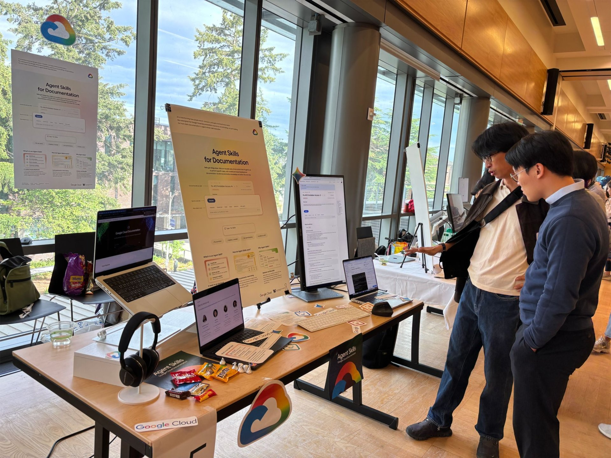

# 申请交互，作品集到底该放什么

我作品集里最不想放的一页，是一个失败方案。界面不完整，也没有最后那版好看。我还是放了。

因为那一页比成品更像我做项目时的样子。我们一开始觉得用户需要一个更详细的功能，访谈和测试做完才发现，问题根本不在信息不够，而在用户不知道下一步会发生什么。后来整条流程都改了。

如果只放最终页面，别人看到的是结果。放进那次修改，别人至少能看到我怎么发现自己错了。

申请交互时，作品集不是作品展。它更接近一份带图的工作记录。

我现在会把每个 case 的第一屏当成一道门槛。读的人滑十秒钟，要知道这是给谁做的、当时卡住的是什么、我在里面干了什么。后面才放研究、草图和页面。很多作品集一开头就是完整 UI，我会下意识觉得作者把最困难的那一段藏起来了。漂亮页面留着，别让它们先发言。

我会保留项目最开始的那个问题。不是“我们做了一个帮助用户的产品”，要写清楚谁在什么情境下遇到了什么麻烦，研究怎么改变了判断。

团队项目尤其要写自己的位置。别写“我们调研了”“我们迭代了”，看不出你到底负责什么。你做的是访谈、信息架构、原型，还是那个一直把大家从跑偏的方案里拉回来的人，差别很大。

写角色时我会交代一个动作和一份证据。比如我访谈了谁，问题怎么从二十条收成六条；我把什么信息重排了，测试里哪个人因此少问了一次路；我和工程同学争的到底是什么。没有很大的数据也可以，别把一次测试写成“验证成功”。五个人说不懂，就写五个人说不懂。这个分寸比漂亮的结果更可信。

还有一点。不要把每个项目都讲成成功案例。

研究结论刚好支持方案，测试刚好证明设计有效，最后用户也满意，这种项目太顺了，反而不太像真的。选一个被放弃的判断讲出来就够。

我还会留一页讲取舍。时间不够时，我们先砍掉了哪个功能，为什么；如果隐私、成本或技术限制把原方案卡住，后来怎么绕过去。申请交互的人不需要假装自己什么都会，老师通常能一眼看出。把边界画出来，反倒说明你知道设计不是只画一个理想状态。

作品集当然要好看。排版乱、图看不清，谁也没义务替你找重点。但好看只是让人愿意往下看。真正有用的是，别人看完知道你遇到模糊问题时，怎么开始。

最后是删。项目不够成熟，就缩成两页，别硬撑成十页；一个 case 能讲完的问题，不要再复制三张几乎一样的流程图。作品集不是把努力全部交出去，是让对方愿意约你聊四十分钟。到那时，你有东西可讲，比页数多重要得多。
