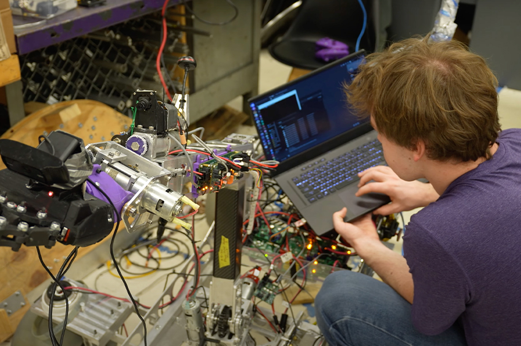
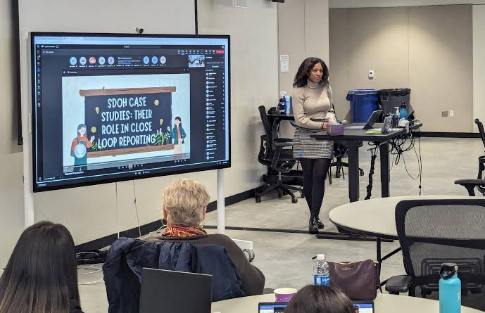

# 转专业申请交互，先想清楚三件事

我把 PS 第一段删了三次。“我一直喜欢设计”和“我想转向更有创造力的行业”都删掉。不是因为它们不真，是因为教授看完还是不知道你做过什么。

转专业的人很容易把自己写成刚发现兴趣的人。没必要。以前学的、做的工作，就算你急着逃离，多少还在起作用。

我以前做软件项目，知道系统出问题时人会卡在哪。后来做作品集，这成了我看用户流程的方式：我从这里开始问问题。

后来整理材料，我给自己做了一张很土的表。左边是以前干过的事，中间写当时解决的具体问题，右边写它和交互有什么关系。比如写接口，不是“我有技术背景”，而是我知道一个看起来很小的交互改动，最后会落到谁的工作量上。做运营，也别只写“沟通能力强”，把你怎样从用户投诉里找到重复问题写出来。这样写，转专业不是洗白过去，是把过去接到现在。

第二件事是看项目，别只看名称。

HCI、UX、Technology Innovation，名字挨得很近，课程差得很远。有人想在一年内把设计方法和作品集补上；有人需要两年做研究、实习；也有人想学硬件、产品和商业怎么一起工作。只因为“好找工作”去申请，入学后很容易拧巴，课程不会按想象改。

我后来只看课程表和学生做过什么，宣传页里的形容词先跳过。

看课程表也别只数 design、research 这些词。我会把每门课翻出来，看作业最后交什么：一份研究报告、一个服务蓝图、可运行的原型，还是论文。再去找两三个在读生问得具体一点：上学期一周到底有几晚留给求职，团队冲突通常怎么处理，老师给的是方向还是直接反馈。对方没空长聊也没关系，问题问得准，十分钟够听出气质。

还有一件不太好听的事：你付不付得起这个转向的代价。一年制很快，几乎没有补短板和实习的窗口。两年制慢，钱和不确定性也更多。

我留了个反向问题：毕业以后没立刻做 UX，这段学习还值不值。答案如果是否定的，我不会申请。项目能帮你换坐标，不能替你把人生风险擦掉。想清楚以后，材料反而好写，把自己为什么去、准备带什么去，说清楚。

还有语言、推荐信和作品集的节奏。转专业最怕把前半年都耗在“我到底算不算有资格”上，最后所有东西挤在截止日前。先定一个真实的交付顺序：把一段能讲清的经历做成 case，再找推荐人，再补最短的板。你不需要变成全能选手才可以申请。你得让人相信，你已经知道自己的缺口在哪里，也知道下一步准备怎么补。
