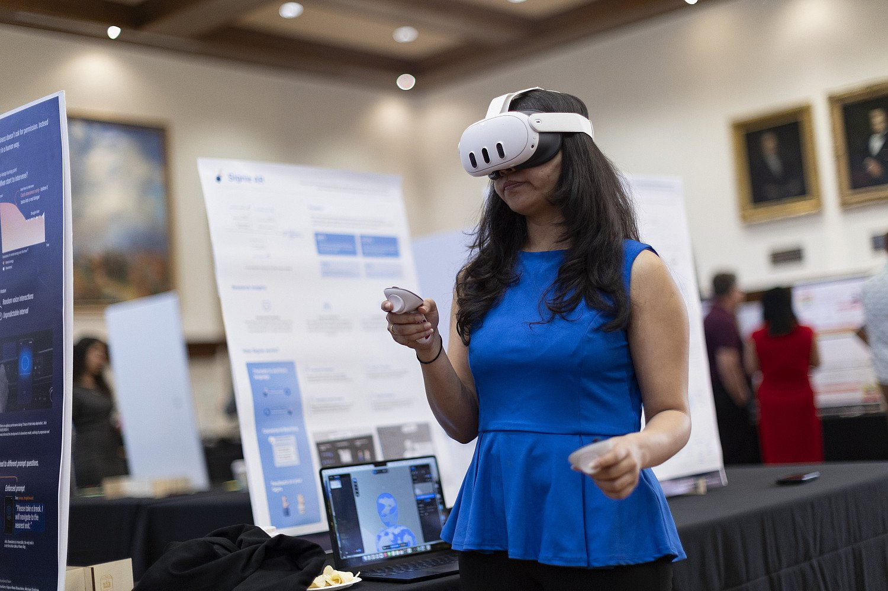
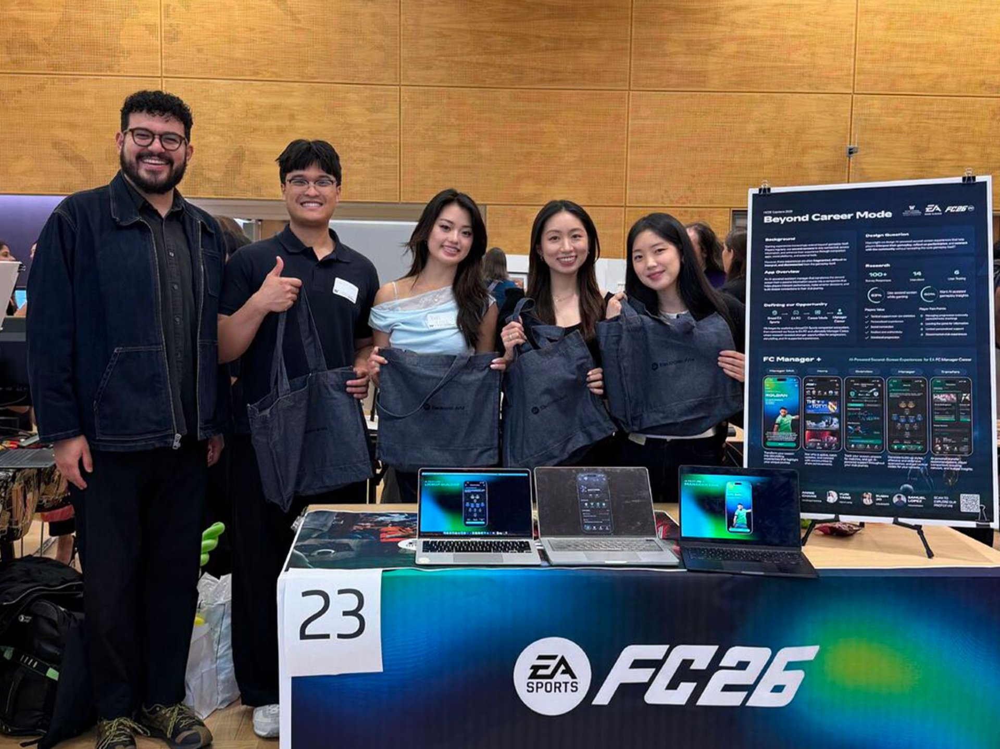

# 11个月的交互硕士，最难的不是熬夜

入学前，所有人都提醒我项目很忙。

我以为忙就是作业多。九点上课，晚上做作业，周末赶项目。这个我能理解，设计学生对熬夜多少有点不切实际的自信。

真正难的不是这个。

难的是你每天都要把一个还没想清楚的东西拿出来，放到桌上，给别人看。组员会问你为什么。老师会问你证据在哪。有人说这个方向太大，有人觉得你把用户想得太简单。你刚花了两天做出来的东西，可能十分钟就被拆得差不多。

一开始我很不适应。我习惯了先自己想完整，至少想得像个样子，再讲出来。这里不行。这里要你在不完整的时候说。说错也没关系，但你得让别人知道你现在卡在哪里。

这件事很耗人。

有段时间我们每天晚上都在 studio 里。电脑开着，白板上贴满便签，桌上是冷掉的咖啡。看上去很像努力，实际上很多时候只是大家都不愿意先回去。回去以后问题也还在。

后来我慢慢学会了一点：不要把每一次 critique 当成对自己的评价。别人否定的通常不是你，是你这周拿出来的那个版本。版本可以改，人没必要跟着一起坍塌。

听起来很普通，但我用了挺久才做到。

毕业后再看，那 11 个月教我的不是“抗压”。抗压这个词太偷懒了。它教我怎么在信息不全、意见很多、时间不够的时候，先做一个暂时可用的判断。然后承认它会变。

工作以后也是这样。没人会等你百分之百确定。
