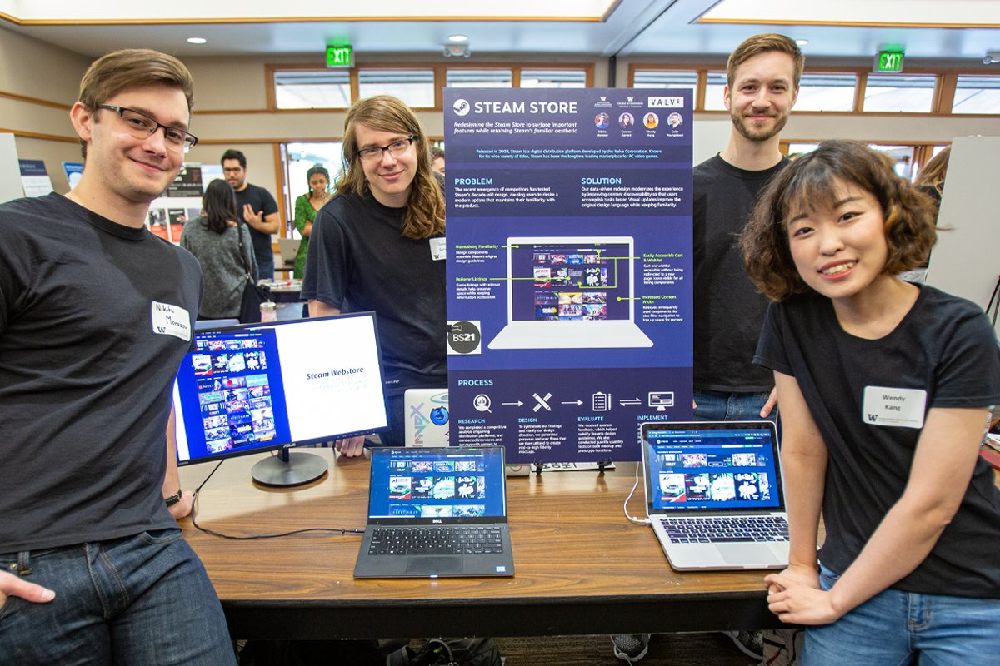
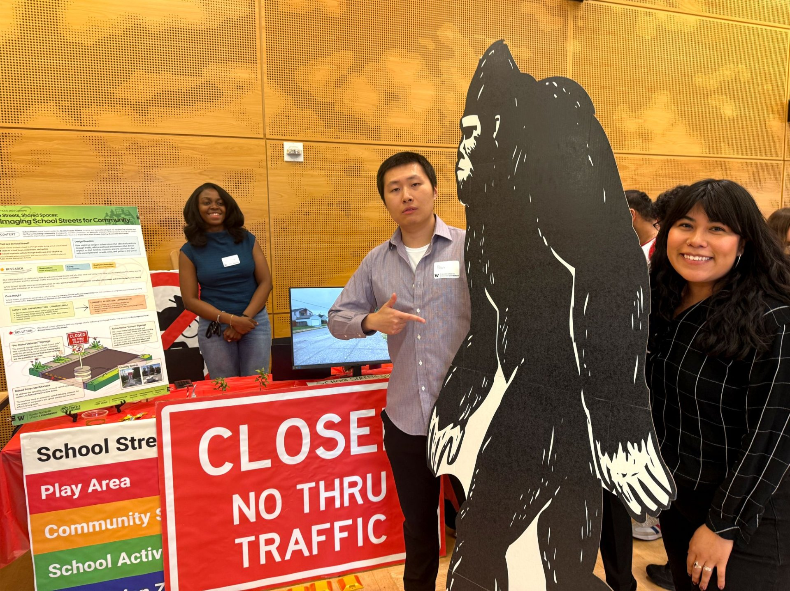

# 在美国读设计后，我不再把团队合作理解成分工

以前小组作业，我最爱说的一句话是：那我们分工吧。

你做调研，我做设计，他做 PPT。听起来很有效率，最后也确实会有一个东西交出来。

但交互项目不是这么简单。

如果只有一个人知道为什么要解决这个问题，其他人只是在领任务，项目到后面一定会散。研究的人得到一堆发现，设计的人已经画了另一条路，做原型的人开始问需求是不是又变了。每个人都很忙，也都没闲着，但东西合不到一起。

后来我明白，合作不是把工作切开。

前面那些最难的判断，问题是什么，用户到底是谁，什么先不做，应该尽量一起承担。后面当然可以分工。不然大家会开会开到毕业。

我现在也不迷信“共创”。有些会真的没必要多开五个人。但至少在方向还没定的时候，别太早把别人变成执行者。

一个人只做自己那一块，最后通常只会保护自己那一块。这个很人性，也很麻烦。
