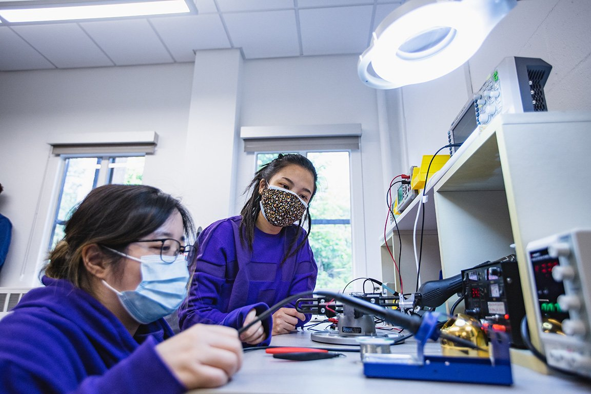

# 想做 UI 的我，为什么不适合 MSTI

我申请时也动过一个念头：去 MSTI，然后做 UI。

听上去没什么问题。学校在西雅图，项目跟技术创新有关，设计也在课程里，毕业以后总能找个 UX 的工作吧。

后来我把这个想法放下了。

不是 MSTI 不好。恰好是因为它太清楚自己在做什么。它关心的不只是屏幕上的体验，而是一个东西从想法到原型、到技术、到团队、到商业上能不能站住。你会碰到硬件、数据、产品策略，甚至一些以前觉得和设计没什么关系的东西。

如果我只想把界面做好，这些课未必是我最需要的。

很多人不爱承认“不适合”，好像只要是好项目就该努力塞进去。其实不是。项目越跨学科，越需要你对自己的兴趣有判断。不是一句“我愿意学习”就能解决。

我后来想明白了，我喜欢的不是 UI 本身。我喜欢的是把很复杂的事情讲得让人能用。这个能力有时在界面里，有时在流程里，有时在一个根本不长在屏幕上的产品里。

这才让我重新考虑 MSTI。

如果你对硬件没兴趣，对技术怎么落地也不想碰，只是希望它给你一个更好看的项目名字，那大概率会很累。课程不会因为你想做纯视觉，就自动变成设计工作室。

选项目前先把那个不太好听的问题问出来：我是真的想学，还是只是想借它的结果。

这个问题不一定马上有答案。但绕开它，后面会更麻烦。
