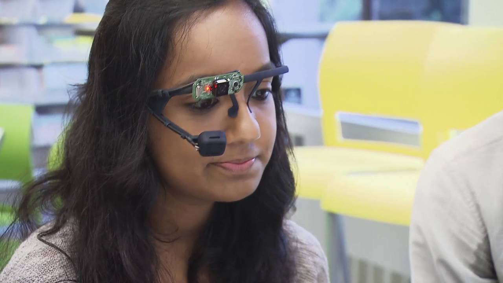
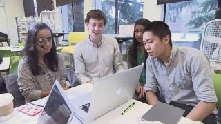

# 我准备的不是自我介绍

招聘会前，有人教我准备 elevator pitch。

三十秒到一分钟，说清自己是谁，做过什么，为什么想来这家公司。听着很像一个简单任务。可我写了好几版，还是觉得像在念简历。

后来我删掉了大半。

学校、项目、工具、奖项，这些东西都能在简历上看到。我真正需要说的是一件更具体的事：我做过什么难题，我怎么处理，为什么我会在意它。

比如我不说“我有用户研究经验”，我说我有一次发现访谈对象一直点头，但实际根本没用过那个功能，所以后来换了问法。这个细节比“熟悉定性研究方法”有用得多。

自我介绍不是把自己压缩成关键词。

是让一个没见过你的人，在一分钟内知道你做事的样子。

当然，别讲太久。对方也只是端着咖啡站在那里，不欠你一个完整的人生故事。
