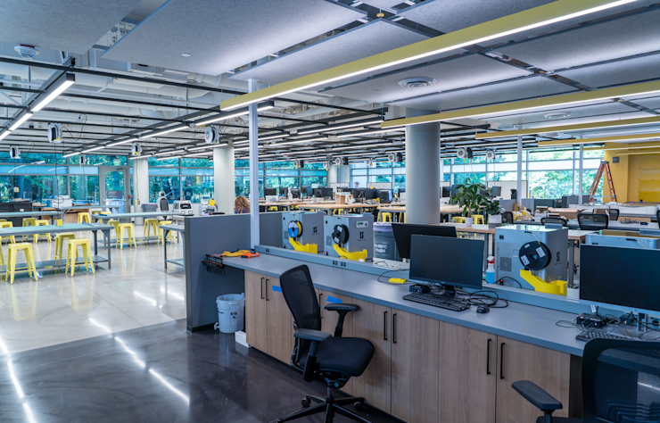

# 我在 HCDE、MHCI+D 和 MSTI 之间，只问了自己一个问题

选项目时，我做过表格。

学制、课程、地点、学费、作品集要求、语言要求，能填的都填进去。填到后面，表格很满，我反而更不知道该选什么。

因为这些信息只会告诉你项目有什么，不会告诉你你要什么。

后来我换了一个问题：两年以后，我希望别人因为什么来找我。

不是职位名称。职位名称会变。今天叫 UX Designer，明天可能叫 Product Designer，后天又多一个听起来很新的词。

我想的是能力。

如果我希望自己能做研究，把模糊的问题说清楚，也能把复杂系统拆开，那我会更看重 HCDE 那种研究、设计和工程并行的训练。如果我想在很高密度的 studio 里做设计，短时间内把作品和职业叙事推起来，MHCI+D 的节奏更像我要的。如果我对一个产品从零开始怎么被造出来感兴趣，也愿意碰技术和商业，MSTI 才有意义。

这不是排名问题。

有些项目会让你更快变成一个“像样的人”，有些会让你先暴露自己哪里不像样。两种都可能有用，只是人不一样。

我最后没有再看太多论坛帖。论坛里每个人都在讲自己的结果，很少有人讲他当时为什么做那个选择。

我想要的不是一个答案，是一个我以后还能解释得通的决定。

