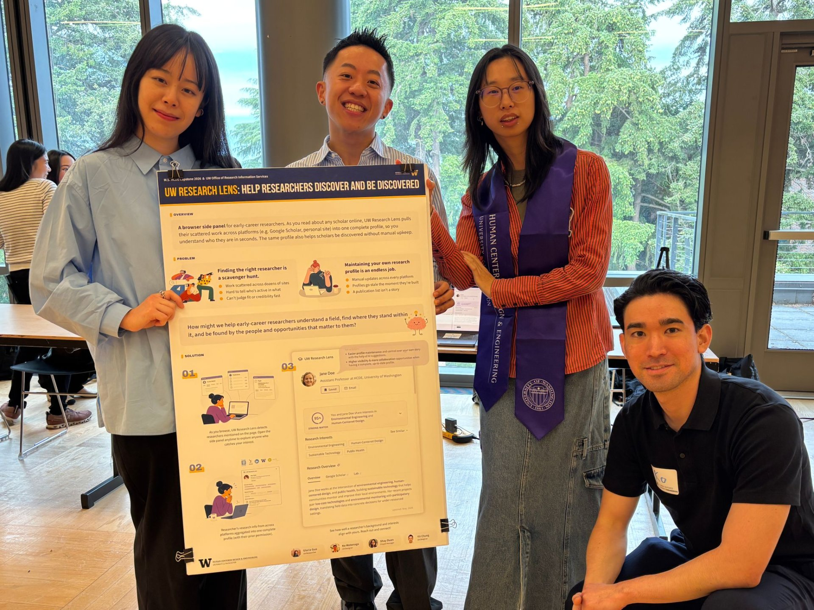
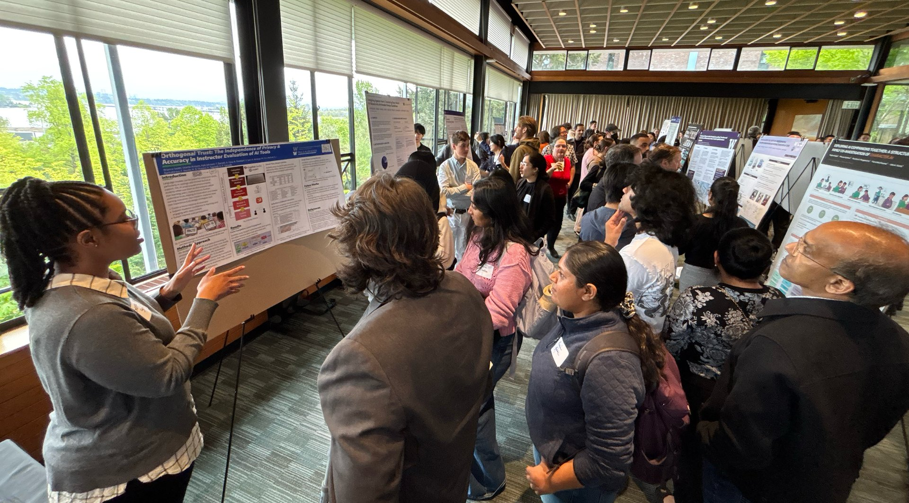

# 我的作品集没有证明我会画图

我以前把作品集理解成一个展览。

最好看的一页放前面，模型拍得干净一点，界面多放几张，视觉上要有“完成度”。这套想法不算错，只是它很容易让人忘记，教授不是在看你的 Behance。

他们在猜：这个人遇到问题时会怎么想，会不会把一件事做完，跟别人合作时是不是麻烦。

后来我删掉了很多“看起来不错”的图。留下来的项目反而没那么整齐。有一页是我最开始画错的流程，有一页是用户测试后改掉的方案，还有一页只写了我在团队里到底做了什么。

我还留了一张被放弃的方案。不是为了显得谦虚，只是它比最后那张高保真图更能说明我为什么改。过程里有证据，成品通常没有。

我开始把作品集当成一份不太正式的工作记录。

不用把自己写得无所不能。一个人什么都会，反而不像真的。你只要让别人看明白：你在意什么，你已经会什么，接下来还缺什么。

我觉得这比排版重要一点。

当然，排版还是得做好。只是不该拿它遮住没有想清楚的东西。
