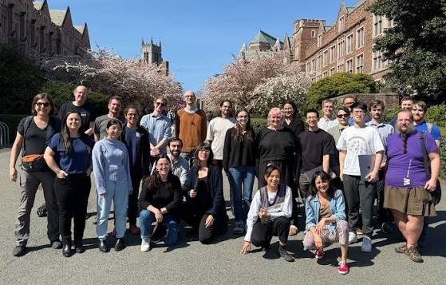
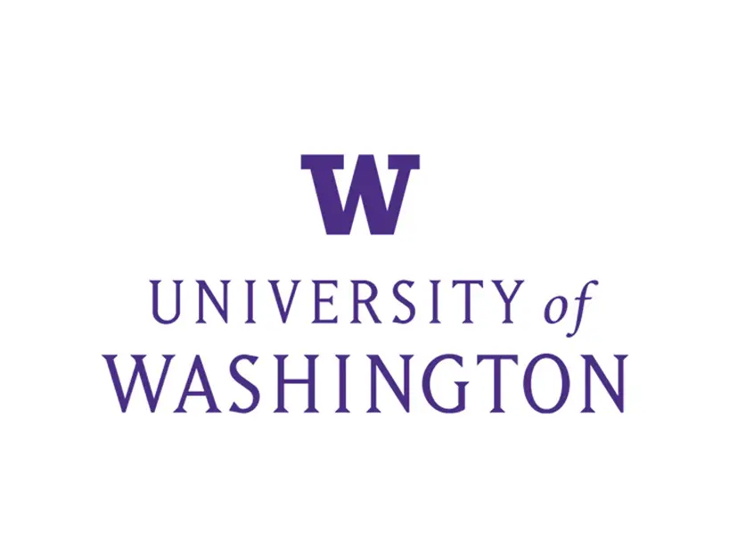

# 西雅图没有替我解决职业焦虑

去西雅图之前，我对这个城市有很多想象。

大公司，技术圈，校友，机会。好像只要人到了那里，职业路径就会自动清晰一点。

后来发现，焦虑会跟着人过海关。

身边的人确实都很厉害。有人早早拿到实习，有人做的项目已经像能上线的产品，有人知道自己要做研究、做设计还是创业。你在这种环境里，很难完全不比较。

但城市也给了我另一种东西。

我第一次见到那么多人，不急着把自己塞进一个身份里。学设计的去学代码，做工程的去做用户研究，工作几年的人回来读书，也有人读完以后换了完全不同的方向。没有谁因为路径绕了一点，就显得很失败。

这不是说西雅图会让人放松。找工作还是难，房租还是贵，阴天多的时候心情也确实会往下掉。

只是我后来没那么急着证明自己“走对了”。

职业不是一道选择题。很多时候你只能先做一个判断，再看它会把你带到哪里。
