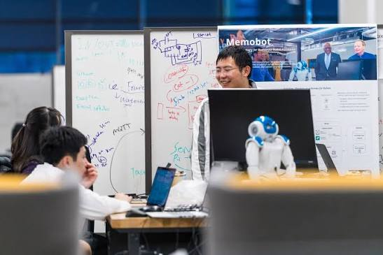
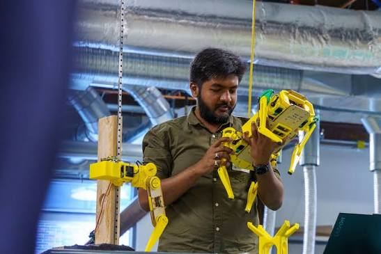

# 读交互设计后，我开始怀疑，让技术更像人，真的是好事吗

刚学交互时，我很喜欢“自然”。

自然的交互，自然的反馈，技术最好让人感觉不到它的存在。后来越学越觉得，这句话有一点危险。

机器越像人，人越容易忘记它不是人。

它会用很亲切的语气说话，会记得你上一次的选择，会在你犹豫时给建议。可它不承担后果。推荐错了，误导了，泄露了信息，最后还是人自己收拾。

有些产品会把停留时间、使用频率和满意度放在一张看板上。它们不总是同一个方向。用户待得更久，可能只是更难离开。

我不是说技术应该冷冰冰。冷冰冰也不是什么美德。

只是设计师有时太急着把摩擦都抹平。确认弹窗太烦，权限说明太长，系统为什么这么判断，用户不需要知道。于是产品越来越顺，用户也越来越难知道自己到底把什么交出去了。

现在做 AI 相关的产品，我会特别在意一个问题：这个“像人”的设计，是在帮人理解，还是在让人放下警惕。

两者看起来很接近。后果不太一样。
