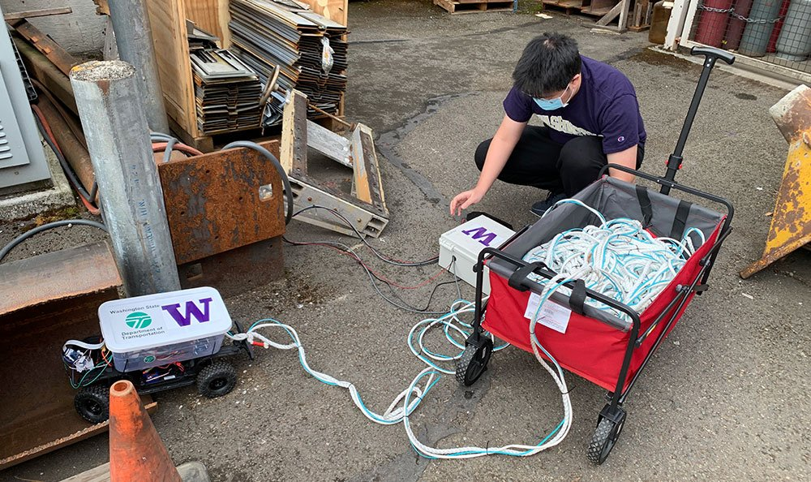
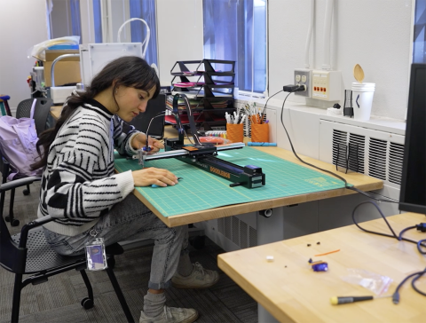

# 软件工程读到一半，我决定不只做会运行的产品

软件工程教会我很多很确定的东西。

代码有没有跑通，数据库能不能查到，接口是不是按预期返回。问题通常有边界。你找到 bug，改掉它，测试过了，这一段就算结束。

我以前很喜欢这种确定。

但后来做项目时，我开始碰到另一类问题。系统没有报错，功能也都在，可是人不想用。有人点进去就退出，有人问完一圈还是不知道自己该做什么。开发同学说需求写的就是这样，设计同学说流程已经很清楚，最后谁也没错。

只是产品不太对。

这个“不太对”很烦。它不像 bug 一样能定位。你不能说第 47 行少了一个分号，也不能靠多加一个按钮解决。

我后来去学交互，很多人会问，那你是不是不想写代码了。

不是。我反而更珍惜技术背景。

做设计时，我知道有些看起来很漂亮的方案会把开发推到什么地方。做工程时，我也更愿意问一句：这个需求为什么存在，用户真的需要它吗，还是我们只是把内部流程搬到了屏幕上。

我不觉得 UX Engineer 是“设计和开发都会一点”的人。那样说太轻了。

更像是你得同时接受两边都不完全满意。设计会觉得你太现实，工程会觉得你总在追问。你夹在中间，常常挺烦的。

但也正因为这样，有时候能少做一点没必要的东西。

我现在看到一个需求，第一反应还是会想它怎么实现。只是第二个问题变成了：实现出来以后，谁会愿意把时间交给它。

